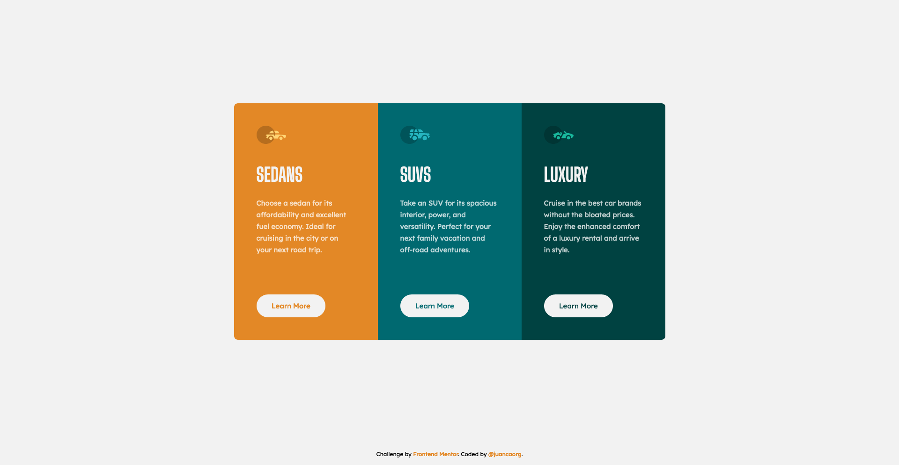

# Frontend Mentor - 3-Column Preview Card

This is a solution to the [3-column preview card component challenge on Frontend Mentor](https://www.frontendmentor.io/challenges/3column-preview-card-component-pH92eAR2-). Frontend Mentor challenges help you improve your coding skills by building realistic projects.

## Table of contents

- [Overview](#overview)
  - [The challenge](#the-challenge)
  - [Screenshot](#screenshot)
  - [Links](#links)
- [My process](#my-process)
  - [Built with](#built-with)
  - [What I learned](#what-i-learned)
- [Author](#author)
- [Acknowledgments](#acknowledgments)

## Overview

### The challenge

Users should be able to:

- View the optimal layout depending on their device's screen size
- See hover states for interactive elements

### Screenshot

### Links

- Solution URL: [GitHub Respository](https://github.com/juancaorg/3-column-preview-card)
- Live Site URL: [3columnpreviewcard.juanca.dev](https://3columnpreviewcard.juanca.dev)

## My process

### Built with

- Semantic HTML5 markup
- CSS custom properties
- CSS Flexbox
- CSS Grid
- Mobile-first workflow

### What I learned

In comparison, this challenge was much easier than other challenges.

In this challenge, I learned how to implement an intermediate/tablet media query in additional to the desktop media query.

## Author

- Website - [juanca.org](https://www.juanca.org)
- Frontend Mentor - [@juancaorg](https://www.frontendmentor.io/profile/juancaorg)
- Twitter - [@juancaorg](https://twitter.com/juancaorg)

## Acknowledgments

Thanks to [@correlucas](https://github.com/correlucas) for [his feedback to use a `single class` to manage the content that is mostly the same for the 3 columns](https://www.frontendmentor.io/solutions/3column-preview-card-html-css-UuKD2J8USI#comment-631b055605bcd1e28bacbaf8).

Now, `.car-column` acts as this single class to manage content instead of using `section` as a selector to manage.
